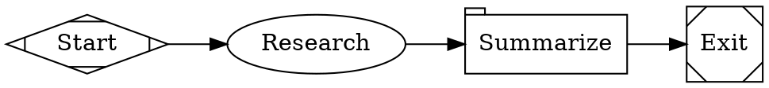

Fabro's [`web_search`](/agents/tools#web_search) tool lets agents search the web during workflow execution. Fabro uses a [SearXNG](https://docs.searxng.org/) instance that you host when `SEARXNG_URL` is configured. There are no API keys and no per-query cost; the instance aggregates results from the search engines you enable.

Fabro selects the backend from the credentials in its vault. SearXNG is preferred whenever `SEARXNG_URL` is present. When that URL is absent, Fabro uses direct [Brave Search](/integrations/brave-search) with `BRAVE_SEARCH_API_KEY`, then [Venice Search](/integrations/venice-search) with `VENICE_API_KEY`.

## Setup

1. Run a SearXNG instance with the JSON format enabled. The stock image needs a
   `settings.yml` that whitelists `json` output:

   ```yaml title="searxng/settings.yml"
   use_default_settings: true

   search:
     formats:
       - html
       - json
   ```

   ```bash
   docker run --rm -d -p 8080:8080 -v "$PWD/searxng:/etc/searxng" searxng/searxng
   ```

   SearXNG returns HTTP 403 to Fabro until `json` is whitelisted.

2. Point Fabro at the instance:

```bash
fabro secret set SEARXNG_URL http://searxng:8080
```

Use a URL that is reachable from the Fabro process. Inside a docker-compose stack, `localhost` is the Fabro container, not your machine — use the compose service name (for example `http://searxng:8080`) instead.

3. Verify the instance is working:

```bash
fabro doctor
```

The doctor output should show **Web Search** as `searxng: configured and reachable`. If the SearXNG URL is missing but a Brave or Venice key exists, Fabro checks that backend instead. If nothing is configured, web search is reported as a warning. Workflows still run, but the `web_search` tool is omitted from the agent's tool set and its system prompt.

The Fabro server reads this URL from the vault only. It does not read `SEARXNG_URL` from process env or `server.env`. The standalone agent CLI reads it from the invoking shell instead.

## How it works

Agents call the `web_search` tool with a query string. Fabro sends `GET {SEARXNG_URL}/search?q=<query>&format=json` and returns numbered results with title, URL, and description. SearXNG has no result-count parameter, so Fabro truncates the response to `max_results` while keeping the instance's ranking order:

```
1. Rust Lang
   https://rust-lang.org
   A systems language
   2026-01-02
```

The `date` line appears when the instance supplies `publishedDate` for a result.

If `SEARXNG_URL` is absent, Fabro uses Brave when `BRAVE_SEARCH_API_KEY` is available, then Venice when `VENICE_API_KEY` is available. If none is configured, the tool is not registered. After selecting SearXNG, a failed call returns an error; Fabro does not retry through Brave or Venice.

See the [`web_search` tool reference](/agents/tools#web_search) for parameters and details.

## Permissions

`web_search` is classified as a `shell` category tool, requiring the `full` [permission level](/agents/permissions) for auto-approval. At lower permission levels:

- **Interactive mode** — the user is prompted to approve each call
- **Non-interactive mode** (`--auto-approve`) — calls are denied

## Example workflow

A workflow that researches a topic before writing about it:



## Troubleshooting

**"SearXNG returned status 403 (enable the json format on the instance: settings.yml → search → formats)"** — The instance does not whitelist the `json` output format. Add `json` to `search.formats` in the instance's `settings.yml` and restart it.

**"SearXNG returned status 429"** — The instance's limiter is throttling Fabro. Disable the limiter for trusted callers or add the Fabro server to its allowlist.

**"HTTP request failed" with connection refused** — The URL is wrong for the network the Fabro process runs in. Inside docker-compose use the service name (`http://searxng:8080`), not `localhost`. Run `fabro doctor` to verify.

**Slow or empty results** — SearXNG aggregates upstream engines, and engines rate-limit the instance's public IP. Enable fewer engines in `settings.yml` or raise the instance's timeout settings.

## Further reading

<Columns cols={2}>
  <Card title="Tools" icon="wrench" href="/agents/tools#web_search">
    Full `web_search` tool reference — parameters, output format, and error handling.
  </Card>
  <Card title="Permissions" icon="lock" href="/agents/permissions">
    How tool permissions control web search access.
  </Card>
</Columns>
